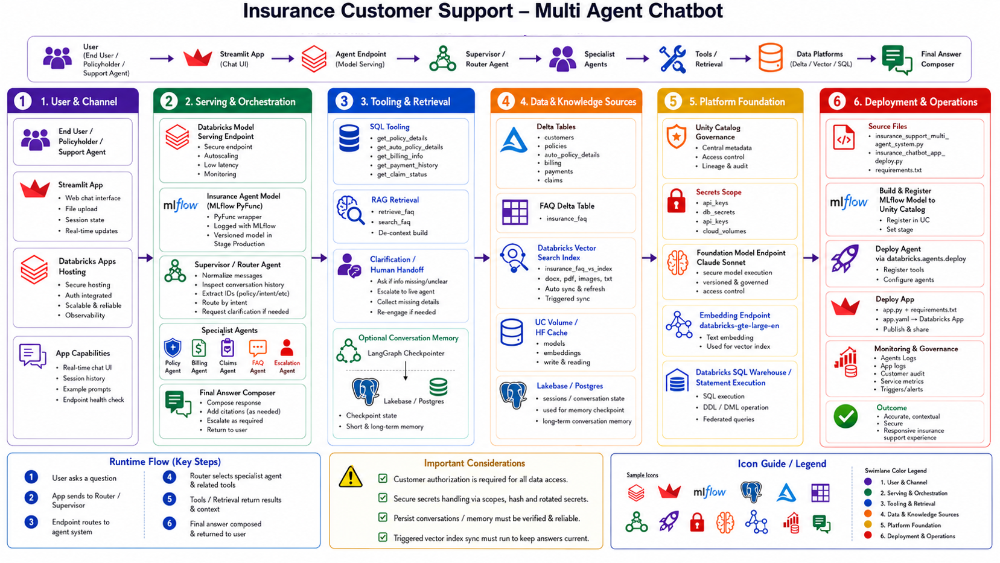
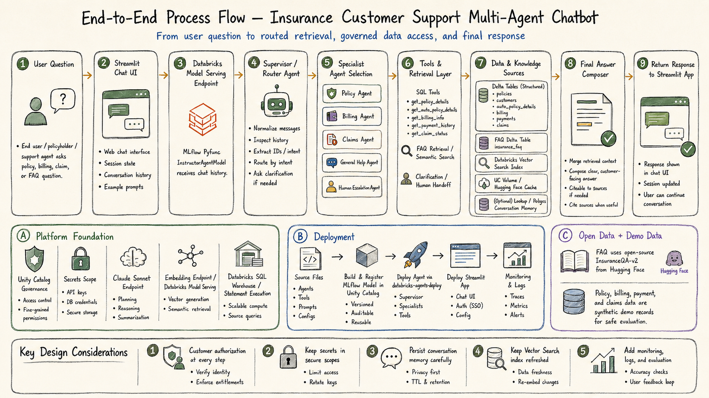

# I Built a Multi-Agent Insurance Support Chatbot on Databricks — Full Code Walkthrough

## LangGraph + Claude Sonnet 4.6 + Vector Search + Lakebase PostgreSQL, from first cell to live endpoint

---

Insurance customer support is one of those domains that sounds simple until you try to automate it properly. A customer asks about their billing — you need their policy number, the current pending bill, the premium frequency, and then a clean human-readable answer. Another customer asks what life insurance covers in general — no account lookup needed, just a well-grounded FAQ response. A third says they want to speak to a human. Different questions, different data sources, different handling logic, all landing in the same chat window.

A single LLM chain with a big system prompt cannot handle this cleanly. You end up with prompt bloat, tool confusion, and an agent that either asks too many clarifying questions or retrieves data it doesn't need. This is exactly where multi-agent architectures earn their keep — and exactly why I chose this problem for the Databricks Hackathon on building intelligent apps with Data + AI.

This article is a complete code walkthrough. I'll cover every section of the notebook — data layer, Vector Search setup, LLM client, all six agent nodes, LangGraph graph compilation, the deployment pipeline, the multimodal vision pipeline — and then the Streamlit chatbot app in detail. Relevant code snippets and flow diagrams are included throughout.

Full code: [abhirup93/Databricks-Hackathon-Build-intelligent-Apps-with-Data-AI](https://github.com/abhirup93/Databricks-Hackathon-Build-intelligent-Apps-with-Data-AI)

---

## Architecture



The system runs across six layers. The user talks to a Streamlit chatbot on Databricks Apps. Every message hits a Databricks Model Serving endpoint wrapping a self-contained MLflow PyFunc — `InsuranceAgentModel`. Inside, a Supervisor agent (Claude Sonnet 4.6) reads the full conversation history, extracts identifiers, and routes to one of five specialist agents. Each specialist has its own tools — SQL against Unity Catalog Delta tables, or a Vector Search semantic query against the FAQ index. A Final Answer Composer polishes the specialist response before it goes back to the user. Multi-turn memory is handled by Lakebase PostgreSQL via LangGraph's `PostgresSaver`.


---

## End-to-End Process Flow



The nine-step flow maps cleanly to the code:
**Steps 1–2** are the Streamlit app (`app.py`). **Step 3** is `InsuranceAgentModel.predict()` on the serving endpoint. **Steps 4–6** are the LangGraph agent nodes and their tool functions. **Step 7** is the Unity Catalog data layer — Delta tables, Vector Search index, UC Volume, and the optional Lakebase PostgreSQL checkpoint. **Steps 8–9** are the Final Answer Composer node and the response path back through the endpoint to Streamlit.

The three lower panels map to: **(A)** the platform prerequisites in Cells 1–4; **(B)** the deployment pipeline in Cells D1–D10; **(C)** the synthetic data and HuggingFace FAQ dataset in Cells 5–12.

**End-to-end request flow:**

```
User types message
  └─► Streamlit App  (Databricks Apps · OAuth via WorkspaceClient)
        └─► Model Serving Endpoint  (MLflow PyFunc · InsuranceAgentModel)
              └─► predict()
                    ├─► Step 1: Reconstruct history · Extract entities (POL/CUST/CLM regex)
                    ├─► Step 2: Clarification bypass?  ──► Direct Specialist ──► Final Answer
                    └─► Step 3: Supervisor routing loop (max 5 iters)
                          └─► Supervisor Agent  (Claude Sonnet 4.6 · JSON routing)
                                ├─► Policy Agent      ──► get_policy_details / get_auto_policy_details
                                ├─► Billing Agent     ──► get_billing_info / get_payment_history
                                ├─► Claims Agent      ──► get_claim_status
                                ├─► General Help      ──► retrieve_faq → Vector Search
                                ├─► Human Escalation  ──► empathetic handoff → END
                                └─► next_agent="end"  ──► Final Answer Composer → END
```

---

## Section 1 — Environment Setup (Cells 1–4)

### Cell 1: Authentication & Configuration

```python
from databricks.sdk import WorkspaceClient
from databricks.vector_search.client import VectorSearchClient

w = WorkspaceClient()

_host = w.config.host
DATABRICKS_HOST = _host if _host.startswith("https://") else f"https://{_host}"
DATABRICKS_TOKEN = w.config.token

CATALOG         = "<YOUR_CATALOG>"
SCHEMA          = "<YOUR_SCHEMA>"
FULL_SCHEMA     = f"{CATALOG}.{SCHEMA}"
LLM_ENDPOINT    = "databricks-claude-sonnet-4-6"
EMBEDDING_ENDPOINT = "databricks-gte-large-en"

vsc              = VectorSearchClient(disable_notice=True)
VS_ENDPOINT_NAME = "<YOUR_VS_ENDPOINT_NAME>"
VS_INDEX_NAME    = f"{FULL_SCHEMA}.<YOUR_VS_INDEX_NAME>"
VS_SOURCE_TABLE  = f"{FULL_SCHEMA}.<YOUR_FAQ_TABLE>"

VOLUME_NAME = "<YOUR_VOLUME_NAME>"
VOLUME_PATH = f"/Volumes/{CATALOG}/{SCHEMA}/{VOLUME_NAME}"
HF_CACHE    = f"{VOLUME_PATH}/hf_cache"
SECRETS_SCOPE = "<YOUR_SECRETS_SCOPE>"
```

`WorkspaceClient()` picks up host and token from the cluster environment — no credentials hardcoded. The host is normalised to always have `https://` because downstream REST API calls fail silently on malformed URLs. The UC Volume path is defined early because it doubles as the HuggingFace download cache, making dataset downloads persistent across cluster restarts.

### Cell 3: Discover Lakebase & Store Credentials in Secrets

Rather than hardcoding the PostgreSQL host, the SDK's `w.postgres` APIs dynamically discover the endpoint:

```python
projects  = list(w.postgres.list_projects())
project   = next((p for p in projects if LAKEBASE_INSTANCE_NAME in p.name), projects[0])
branches  = list(w.postgres.list_branches(parent=project.name))
endpoints = list(w.postgres.list_endpoints(parent=branches[0].name))
endpoint  = endpoints[0]

pg_host     = endpoint.status.hosts.host
pg_endpoint = endpoint.name
pg_username = w.current_user.me().user_name

# Clean-slate secrets — delete scope if it exists, recreate fresh
try:
    for s in w.secrets.list_secrets(scope=SECRETS_SCOPE):
        w.secrets.delete_secret(scope=SECRETS_SCOPE, key=s.key)
    w.secrets.delete_scope(scope=SECRETS_SCOPE)
except Exception: pass

w.secrets.create_scope(scope=SECRETS_SCOPE)

# Create a 1-year PAT for Lakebase auth
token_resp  = w.tokens.create(comment="Insurance Support Lakebase Auth",
                               lifetime_seconds=60*60*24*365)
pg_password = token_resp.token_value

for key, value in {"pg_host": pg_host, "pg_endpoint": pg_endpoint,
                   "pg_dbname": "databricks_postgres",
                   "pg_username": pg_username, "pg_password": pg_password}.items():
    w.secrets.put_secret(scope=SECRETS_SCOPE, key=key, string_value=value)

del pg_password, token_resp  # clear from memory immediately
```

The "clean slate" approach — deleting and recreating the scope — prevents stale credentials from causing confusion on repeated runs. `del pg_password, token_resp` immediately after storage is a simple security practice: don't leave credentials in notebook memory longer than necessary.

### Cell 4: Connect to Lakebase + Initialise PostgresSaver

```python
from langgraph.checkpoint.postgres import PostgresSaver
import psycopg
from urllib.parse import quote

PG_HOST     = dbutils.secrets.get(scope=SECRETS_SCOPE, key="pg_host")
PG_ENDPOINT = dbutils.secrets.get(scope=SECRETS_SCOPE, key="pg_endpoint")
PG_DBNAME   = dbutils.secrets.get(scope=SECRETS_SCOPE, key="pg_dbname")
PG_USERNAME = dbutils.secrets.get(scope=SECRETS_SCOPE, key="pg_username")

cred   = w.postgres.generate_database_credential(endpoint=PG_ENDPOINT)
DB_URI = (
    f"postgresql://{quote(PG_USERNAME, safe='')}:{quote(cred.token, safe='')}"
    f"@{PG_HOST}:5432/{PG_DBNAME}?sslmode=require"
)

# Step 1: Create checkpoint tables (must use context manager)
with PostgresSaver.from_conn_string(DB_URI) as tmp:
    tmp.setup()

# Step 2: Persistent connection for LangGraph
pg_conn      = psycopg.connect(DB_URI, autocommit=True)
checkpointer = PostgresSaver(pg_conn)
```

Two-step pattern that catches people out: `from_conn_string(...).setup()` in a context manager creates the three checkpoint tables (`checkpoints`, `checkpoint_blobs`, `checkpoint_writes`). Without this, the persistent connection will fail immediately with a "relation does not exist" Postgres error. The URL-encoded username and token handle the `@` in email addresses that would otherwise break the connection string parser. OAuth credentials are generated fresh per session because they're short-lived.

---

## Section 2 — Data Layer (Cells 5–7)

### Cell 5: Synthetic Data Generation

Six tables are generated in memory with fixed random seeds:

```python
customers = pd.DataFrame({
    "customer_id": [f"CUST{str(i).zfill(5)}" for i in range(1, 1001)],
    ...
})
policies = pd.DataFrame({
    "policy_number": [f"POL{str(i).zfill(6)}" for i in range(1, 1501)],
    "policy_type":   [random.choice(["auto", "home", "life"]) for _ in range(1500)],
    ...
})
billing = pd.DataFrame({
    "bill_id":        [f"BILL{str(i).zfill(6)}" for i in range(1, 5001)],
    "policy_number":  [random.choice(policies["policy_number"]) for _ in range(5000)],
    "status":         [random.choice(["paid", "pending", "overdue"]) for _ in range(5000)],
    ...
})
```

Billing records are randomly assigned to any policy — meaning some policies will have multiple records and some will have none. This random assignment is the root cause of the INNER JOIN bug discovered during testing (more on this in the tools section).

### Cell 6: Write to Delta

```python
def write_delta_table(df_pandas, table_name, mode="overwrite"):
    full_table = f"{FULL_SCHEMA}.{table_name}"
    (spark.createDataFrame(df_pandas)
          .write.format("delta")
          .mode(mode)
          .option("overwriteSchema", "true")
          .saveAsTable(full_table))

for table_name, df in sample_data.items():
    write_delta_table(df, table_name)
```

`overwriteSchema=true` replaces the schema on each run — useful during development when iterating on the data structure.

---

## Section 3 — Vector Search & FAQ Knowledge Base (Cells 8–14)

### Cell 8: Download & Prepare FAQ Dataset

```python
from huggingface_hub import snapshot_download

local_path = snapshot_download(
    repo_id="deccan-ai/insuranceQA-v2",
    repo_type="dataset",
    local_dir=HF_CACHE,
    local_dir_use_symlinks=False,
)

df_faq = pd.concat([pd.read_parquet(f) for f in parquet_files], ignore_index=True)
df_faq = df_faq.rename(columns={"input": "question", "output": "answer"})
df_faq["combined"] = "Question: " + df_faq["question"] + " \nAnswer: " + df_faq["answer"]
df_faq = df_faq.sample(500, random_state=42).reset_index(drop=True)
df_faq.insert(0, "id", range(1, len(df_faq) + 1))
```

Writing to the UC Volume (`HF_CACHE`) makes the download persistent across cluster restarts. The `combined` field concatenates question and answer — this is what GTE Large embeds for the Vector Search index. An integer `id` column is inserted as a primary key because Vector Search requires one for managed Delta Sync indexes.

### Cells 9–12: Delta Table → Vector Search Index

```python
# Cell 9: Write to Delta with Change Data Feed enabled
(spark.createDataFrame(df_faq)
      .write.format("delta").mode("overwrite")
      .option("delta.enableChangeDataFeed", "true")
      .saveAsTable(FAQ_TABLE))

# Cell 11: Create VS endpoint
vsc.create_endpoint_and_wait(name=VS_ENDPOINT_NAME, endpoint_type="STANDARD")

# Cell 12: Create Delta Sync index
vsc.create_delta_sync_index_and_wait(
    endpoint_name=VS_ENDPOINT_NAME,
    index_name=VS_INDEX_NAME,
    source_table_name=VS_SOURCE_TABLE,
    pipeline_type="TRIGGERED",
    primary_key="id",
    embedding_source_column="combined",
    embedding_model_endpoint_name=EMBEDDING_ENDPOINT,
)
```

CDF (`delta.enableChangeDataFeed`) is a hard requirement for Delta Sync indexes — without it Vector Search cannot track incremental changes. Databricks fires the initial embedding sync automatically on index creation, so a manual `idx.sync()` call is redundant at first setup.

**Cell 14 — VS Smoke Test:**

```python
idx = vsc.get_index(endpoint_name=VS_ENDPOINT_NAME, index_name=VS_INDEX_NAME)
test_response = idx.similarity_search(
    query_text="What does life insurance cover?",
    columns=["id", "question", "answer"],
    num_results=3,
)
col_names = [c["name"] for c in test_response["manifest"]["columns"]]
rows      = test_response["result"]["data_array"]
# column names come from manifest, data from result — zip them together
```

The column names come from `manifest`, not from `result` — zip them with each data array row to build dicts. If this returns three populated records, the embedding pipeline is working end to end.

---

## Section 4 — LLM Client, Tool Functions & Prompts (Cells 15–18)

### Cell 15: LLM Client

```python
from mlflow.deployments import get_deploy_client

deploy_client = get_deploy_client("databricks")
_test = deploy_client.predict(
    endpoint=LLM_ENDPOINT,
    inputs={"messages": [{"role": "user", "content": "Say OK in 2 words."}], "max_tokens": 10},
)
```

### Cell 16: Two-Pass Tool Calling — run_llm()

```python
def run_llm(prompt, tools=None, tool_functions=None, model=LLM_ENDPOINT):
    inputs = {
        "messages": [
            {"role": "system", "content": prompt},
            {"role": "user",   "content": "Please process the above instructions and respond."},
        ],
        "max_tokens": 2048,
    }
    if tools:
        inputs["tools"]       = tools
        inputs["tool_choice"] = "auto"

    # ── Pass 1 ────────────────────────────────────────────────────
    response = deploy_client.predict(endpoint=model, inputs=inputs)
    message  = response["choices"][0]["message"]

    if not message.get("tool_calls"):
        return message.get("content") or ""  # no tools called → return immediately

    # ── Execute tools locally ─────────────────────────────────────
    tool_messages = []
    for tc in message["tool_calls"]:
        func_name = tc["function"]["name"]
        args      = json.loads(tc["function"].get("arguments") or "{}")
        tool_fn   = tool_functions.get(func_name)
        try:
            result = tool_fn(**args) if tool_fn else {"error": f"Tool '{func_name}' not found"}
        except Exception as e:
            result = {"error": str(e)}
        tool_messages.append({"role": "tool", "tool_call_id": tc["id"],
                               "content": json.dumps(result)})

    # ── Pass 2: send tool results back ────────────────────────────
    followup = [
        {"role": "system",    "content": prompt},
        {"role": "user",      "content": "Please process the above instructions and use the available tools."},
        {"role": "assistant", "content": message.get("content"), "tool_calls": message["tool_calls"]},
        *tool_messages,
    ]
    final = deploy_client.predict(endpoint=model, inputs={"messages": followup, "max_tokens": 2048})
    return final["choices"][0]["message"].get("content") or ""
```

**Two-pass flow:**

```
Pass 1  prompt + tools ──► Claude ──► tool_calls? ──No──► return content
                                              │
                                             Yes
                                              ▼
                                    Execute each tool locally
                                              │
Pass 2  prompt + tool results ──► Claude ──► final natural language answer
```

Every tool function returns `{"error": str(e)}` on exception — a consistent contract that lets Claude give a graceful response rather than crashing the agent.

### Cell 17: Tool Functions (Spark DataFrame API)

```python
def get_policy_details(policy_number: str) -> Dict[str, Any]:
    df  = (spark.table(f"{FULL_SCHEMA}.policies")
               .join(spark.table(f"{FULL_SCHEMA}.customers"), on="customer_id", how="inner")
               .filter(F.col("policy_number") == policy_number))
    row = df.first()
    return row.asDict() if row else {"error": f"Policy {policy_number} not found"}

def get_billing_info(policy_number=None, customer_id=None) -> Dict[str, Any]:
    billing_df  = spark.table(f"{FULL_SCHEMA}.billing")
    policies_df = spark.table(f"{FULL_SCHEMA}.policies")
    joined      = billing_df.join(policies_df, on="policy_number", how="inner")  # ⚠️ INNER JOIN bug
    if policy_number:
        filtered = joined.filter((F.col("billing.policy_number") == policy_number)
                                 & (F.col("billing.status") == "pending"))
    ...
    row = filtered.orderBy(F.col("due_date").desc()).first()
    return row.asDict() if row else {"error": "No pending billing information found"}

def retrieve_faq(query_text: str, num_results: int = 3) -> List[Dict]:
    idx      = vsc.get_index(endpoint_name=VS_ENDPOINT_NAME, index_name=VS_INDEX_NAME)
    response = idx.similarity_search(query_text=query_text,
                                     columns=["id", "question", "answer"],
                                     num_results=num_results)
    col_names = [c["name"] for c in response["manifest"]["columns"]]
    return [dict(zip(col_names, row)) for row in (response["result"].get("data_array") or [])]
```

**⚠️ The INNER JOIN bug:** `get_billing_info()` joins billing and policies with `how="inner"` and filters for `status='pending'`. If a policy has no pending billing records, the join returns empty — the tool returns `{"error": "No pending billing information found"}` and Claude gives the user a polite apology. The deployed model fixes this with a LEFT JOIN so `premium_amount` is always returned from the policies table. The notebook and deployed model are inconsistent on this point — a known limitation documented in the debug section.

### Cell 18: Prompt Templates

The Supervisor prompt is the most critical. Key excerpts:

```
You are the SUPERVISOR AGENT managing a team of insurance support specialists.

CRITICAL RULES:
- If policy number is already available, DO NOT ask for it again.
- If customer ID is already available, DO NOT ask for it again.
- Only use ask_user tool if ESSENTIAL information is missing.

SPECIALIST AGENTS:
- policy_agent       → policy details, coverage, endorsements, auto policy specifics
- billing_agent      → billing, payments, premium questions
- claims_agent       → claim filing, tracking, settlements
- general_help_agent → general insurance questions (no policy number needed)
- human_escalation_agent → complex or sensitive cases

Respond ONLY in JSON:
{
  "next_agent": "<agent_name or 'end'>",
  "task": "<concise task description>",
  "justification": "<why this decision>"
}
```

Routing logic lives in the prompt, not in hard-coded keyword matching. The supervisor makes decisions based on the full conversation — ambiguous queries like "my car is making a noise, will my insurance cover it?" get routed to `general_help_agent` for a FAQ search, not misrouted to `claims_agent`.

---

## Section 5 — LangGraph Agent System (Cells 19–24)

### Cell 19: GraphState

```python
from langgraph.graph import StateGraph, END, add_messages
from typing import TypedDict, Annotated, Optional

class GraphState(TypedDict):
    # ── LangGraph messages accumulator ───────────────────────────
    messages:              Annotated[List[Any], add_messages]
    # ── Context (persists across turns via Lakebase checkpoint) ──
    user_input:            str
    conversation_history:  Optional[str]
    policy_number:         Optional[str]
    customer_id:           Optional[str]
    claim_id:              Optional[str]
    # ── Routing (reset each turn) ─────────────────────────────────
    next_agent:            Optional[str]
    task:                  Optional[str]
    n_iteration:           Optional[int]
    end_conversation:      Optional[bool]
    requires_human_escalation: bool
    # ── Clarification ─────────────────────────────────────────────
    needs_clarification:   Optional[bool]
    clarification_question: Optional[str]
    user_clarification:    Optional[str]
    # ── Billing-specific ──────────────────────────────────────────
    billing_amount:        Optional[float]
    payment_method:        Optional[str]
    billing_frequency:     Optional[str]
    final_answer:          Optional[str]
```

`add_messages` on the `messages` field means LangGraph appends rather than replaces on each state update. Context fields (`policy_number`, `customer_id`, `conversation_history`) are never reset between turns — they persist via Lakebase. Routing fields are reset at the start of each `run_query()` call.

### Cell 20: Tool Schemas (OpenAI Function-Calling Format)

```python
SUPERVISOR_TOOLS = [{
    "type": "function",
    "function": {
        "name": "ask_user",
        "description": "Ask the user for essential missing information",
        "parameters": {
            "type": "object",
            "properties": {
                "question":     {"type": "string"},
                "missing_info": {"type": "string"},
            },
            "required": ["question", "missing_info"],
        },
    },
}]

BILLING_TOOLS = [
    {"type": "function", "function": {
        "name": "get_billing_info",
        "description": "Retrieve current billing information including balance and due date",
        "parameters": {"type": "object", "properties": {
            "policy_number": {"type": "string"},
            "customer_id":   {"type": "string"},
        }},
    }},
    {"type": "function", "function": {
        "name": "get_payment_history",
        "description": "Fetch the most recent payment records for a policy",
        "parameters": {"type": "object",
                       "properties": {"policy_number": {"type": "string"}},
                       "required": ["policy_number"]},
    }},
]
```

`SUPERVISOR_TOOLS` has only `ask_user` — the supervisor's only action is clarification. All retrieval tools belong to specialist agents. The General Help agent has no tool schema at all — its retrieval is done inline before the `run_llm()` call.

### Cell 21: Agent Node Implementations

**Supervisor node** — the core of the system:

```python
def supervisor_agent(state: GraphState) -> GraphState:
    n_iter = (state.get("n_iteration") or 0) + 1
    state  = {**state, "n_iteration": n_iter}

    # ── Force escalation at max iterations ────────────────────────
    if n_iter >= 6:
        return {**state, "requires_human_escalation": True,
                "next_agent": "human_escalation_agent"}

    # ── Process clarification response ────────────────────────────
    if state.get("needs_clarification"):
        updated_conv = (state.get("conversation_history") or "") + \
            f"\nAssistant: {state['clarification_question']}\nUser: {state['user_clarification']}"
        state = {**state, "needs_clarification": False,
                 "conversation_history": updated_conv,
                 "clarification_question": None}

    # ── Routing decision ──────────────────────────────────────────
    response = deploy_client.predict(endpoint=LLM_ENDPOINT, inputs={
        "messages": [
            {"role": "system", "content": SUPERVISOR_PROMPT.format(
                conversation_history=state.get("conversation_history"))},
            {"role": "user",   "content": "Analyze and decide the next action."},
        ],
        "tools": SUPERVISOR_TOOLS, "tool_choice": "auto", "max_tokens": 1024,
    })
    message = response["choices"][0]["message"]

    # ── Handle ask_user tool call ──────────────────────────────────
    if message.get("tool_calls"):
        for tc in message["tool_calls"]:
            if tc["function"]["name"] == "ask_user":
                args     = json.loads(tc["function"].get("arguments") or "{}")
                question = args.get("question", "Can you provide more details?")
                user_resp_data = ask_user(question, args.get("missing_info", ""))
                return {**state, "needs_clarification": True,
                        "clarification_question": question,
                        "user_clarification": user_resp_data["context"]}

    # ── Parse JSON routing decision ───────────────────────────────
    raw    = re.sub(r"^```(?:json)?\s*\n?", "", (message.get("content") or "{}").strip())
    raw    = re.sub(r"\n?```\s*$", "", raw)
    parsed = json.loads(raw)
    return {**state, "next_agent": parsed.get("next_agent", "general_help_agent"),
            "task": parsed.get("task", ""), "justification": parsed.get("justification", "")}
```

**Supervisor execution flow:**

```
supervisor_agent()
  │
  ├─► n_iteration >= 6? ──Yes──► force human_escalation_agent
  │
  ├─► needs_clarification? ──Yes──► fold user answer into history → continue
  │
  ├─► Call Claude with SUPERVISOR_TOOLS
  │     │
  │     ├─► tool_calls? (ask_user) ──► call ask_user() ──► set needs_clarification=True ──► return
  │     │
  │     └─► JSON response ──► strip fences ──► parse ──► set next_agent, task, justification
  │
  └─► return updated state
```

**Policy agent node** (all specialist nodes follow this pattern):

```python
def policy_agent_node(state: GraphState) -> GraphState:
    prompt = POLICY_AGENT_PROMPT.format(
        task=state.get("task"),
        policy_number=state.get("policy_number") or "Not provided",
        customer_id=state.get("customer_id") or "Not provided",
        conversation_history=state.get("conversation_history") or "",
    )
    result = run_llm(prompt, tools=POLICY_TOOLS,
                     tool_functions={
                         "get_policy_details":      get_policy_details,
                         "get_auto_policy_details": get_auto_policy_details,
                     })
    current_history = state.get("conversation_history") or ""
    return {**state,
            "messages":             [("assistant", result)],
            "conversation_history": current_history + f"\nPolicy Agent: {result}"}
```

**General Help agent** — uses inline RAG, not tool calling:

```python
def general_help_agent_node(state: GraphState) -> GraphState:
    # Retrieve FAQs BEFORE building the prompt
    faq_results = retrieve_faq(query_text=state.get("user_input") or "", num_results=3)
    faq_context = ""
    for i, item in enumerate(faq_results, 1):
        faq_context += f"FAQ {i}:\nQ: {item.get('question','')}\nA: {item.get('answer','')}\n\n"
    if not faq_context:
        faq_context = "No relevant FAQs were found in the knowledge base."

    prompt = GENERAL_HELP_PROMPT.format(
        task=state.get("task") or "General insurance support",
        conversation_history=state.get("conversation_history") or "",
        faq_context=faq_context,
    )
    result = run_llm(prompt)  # no tools — context already injected into prompt
    ...
```

### Cell 22: Routing Function

```python
def decide_next_agent(state: GraphState) -> str:
    if state.get("needs_clarification"):      return "supervisor_agent"
    if state.get("end_conversation"):         return "end"
    if state.get("requires_human_escalation"):return "human_escalation_agent"
    return state.get("next_agent") or "general_help_agent"
```

Four checks, priority order. Clarification loops back to the supervisor. End routes to the LangGraph `END` sentinel. Escalation bypasses the final answer agent entirely.

### Cell 23: Build & Compile the Graph

```python
workflow = StateGraph(GraphState)

# Register all nodes
workflow.add_node("supervisor_agent",        supervisor_agent)
workflow.add_node("policy_agent",            policy_agent_node)
workflow.add_node("billing_agent",           billing_agent_node)
workflow.add_node("claims_agent",            claims_agent_node)
workflow.add_node("general_help_agent",      general_help_agent_node)
workflow.add_node("human_escalation_agent",  human_escalation_node)
workflow.add_node("final_answer_agent",      final_answer_agent)

workflow.set_entry_point("supervisor_agent")

# Supervisor conditional routing
workflow.add_conditional_edges("supervisor_agent", decide_next_agent, {
    "supervisor_agent":       "supervisor_agent",   # clarification self-loop
    "policy_agent":           "policy_agent",
    "billing_agent":          "billing_agent",
    "claims_agent":           "claims_agent",
    "general_help_agent":     "general_help_agent",
    "human_escalation_agent": "human_escalation_agent",
    "end":                    "final_answer_agent",
})

# Back-edges: all specialists return to supervisor for re-evaluation
for specialist in ["policy_agent", "billing_agent", "claims_agent", "general_help_agent"]:
    workflow.add_edge(specialist, "supervisor_agent")

# Terminal edges
workflow.add_edge("final_answer_agent",     END)
workflow.add_edge("human_escalation_agent", END)

# Compile with Lakebase checkpointer
app = workflow.compile(checkpointer=checkpointer)
```

**LangGraph topology:**

```
                    ┌─────────────────────────────────┐
                    │          supervisor_agent         │◄──────────────────────┐
                    │  (entry point · conditional out)  │◄──────────────────┐  │
                    └──────────────┬──────────────────-─┘                   │  │
                ┌──────────────────┼─────────────────────────────────┐      │  │
                ▼                  ▼              ▼                   ▼      │  │
         policy_agent      billing_agent    claims_agent    general_help_agent│  │
               │                  │              │                   │       │  │
               └──────────────────┴──────────────┴───────────────────┘ back-edges
                                                                            │  │
         supervisor ─► "end" ──► final_answer_agent ──► END                │  │
         supervisor ──────────► human_escalation_agent ──► END             │  │
         supervisor ─────────────────────────────────────────► self (clarification)
```

---

## Section 6 — Testing (Cells 25–32)

### Cell 25: Test Runner — run_query()

```python
_TURN_RESET_FIELDS = {
    "n_iteration": 0, "end_conversation": False, "final_answer": "",
    "needs_clarification": False, "clarification_question": None,
    "user_clarification": None, "next_agent": "supervisor_agent",
    "requires_human_escalation": False, "messages": [],
}

def run_query(query: str, thread_id: str = None) -> tuple:
    config    = {"configurable": {"thread_id": thread_id or str(uuid.uuid4())}}
    thread_id = config["configurable"]["thread_id"]
    snapshot  = app.get_state(config)

    if snapshot.values:
        # Follow-up turn: resume checkpoint, reset only operational fields
        prior_history = snapshot.values.get("conversation_history", "")
        state_input   = {
            **snapshot.values,       # ← full checkpoint (policy_number etc preserved)
            **_TURN_RESET_FIELDS,    # ← reset iteration counter, flags, final_answer
            "user_input":            query,
            "conversation_history":  prior_history + f"\nUser: {query}",
        }
    else:
        # First turn: blank state
        state_input = {**_BLANK_STATE, "user_input": query,
                       "conversation_history": f"User: {query}"}

    final_state = app.invoke(state_input, config=config)
    print(final_state.get("final_answer") or "No final answer generated.")
    return final_state, thread_id
```

**Multi-turn memory flow:**

```
Turn 1 (thread_id=T1)
  snapshot.values → empty → blank state
  user asks: "What is my auto insurance premium?"
  supervisor → ask_user → user provides POL000066
  billing_agent retrieves data → final_answer → Lakebase checkpoint saved

Turn 2 (thread_id=T1, same session)
  snapshot.values → loaded from Lakebase
  policy_number = "POL000066" already in state  ← no re-asking
  user asks: "What about my payment history?"
  supervisor → billing_agent (knows policy_number) → final_answer
```

**Test scenarios covered:**

| Cell | Query | Expected flow |
|---|---|---|
| 26 | "What is the premium of my auto insurance policy?" | Supervisor → ask_user → billing_agent → final_answer |
| 27 | "In general, what does life insurance cover?" | Supervisor → general_help_agent (VS RAG) → final_answer |
| 28 | "I want to speak to a human executive." | Supervisor → human_escalation_agent → END |
| 29 | "What type of policy do I have and when does it expire?" | Supervisor → ask_user → policy_agent → final_answer |
| 30 | "What is the premium for that policy?" (thread4 resume) | Checkpoint loaded → billing_agent (no re-ask) → final_answer |
| 32 | "What is the status of my recent claim?" | Supervisor → ask_user → claims_agent → final_answer |

---

## Section 7 — Vision Pipeline (Cells V1–V8)

This is independent of the LangGraph graph — a sequential five-step multimodal claim processing pipeline using Claude Sonnet 4.6 vision. Sample images are in `Sample Images for Claim Processing/`.

**Pipeline flow:**

```
Car damage image ──► V3: Damage extraction JSON
DL image         ──► V4: OCR extraction JSON
Claim form image  ──► V5: Form extraction JSON (22 fields)
                              │
                        V6: Cross-document consistency checks
                              ├─► vehicle details: image vs form (fuzzy match)
                              ├─► DL details: license vs form
                              └─► policy_end_date >= incident_date?
                              │
                    all_passed?
                    ├── No ──► Claim Rejected
                    └── Yes ──► V7: Vector Search coverage lookup
                                      └─► Route to Claim Handler
```

### Cell V2: Vision Helpers

```python
def encode_image(path: str) -> tuple:
    suffix     = Path(path).suffix.lower()
    media_type = {".png": "image/png", ".jpg": "image/jpeg"}.get(suffix, "image/png")
    with open(path, "rb") as f:
        b64 = base64.standard_b64encode(f.read()).decode("utf-8")
    return b64, media_type

def vision_call(image_path: str, system_prompt: str, user_prompt: str) -> str:
    b64_data, media_type = encode_image(image_path)
    data_url = f"data:{media_type};base64,{b64_data}"  # OpenAI-compatible data URL

    response = deploy_client.predict(endpoint=LLM_ENDPOINT, inputs={
        "messages": [
            {"role": "system", "content": system_prompt},
            {"role": "user",   "content": [
                {"type": "image_url", "image_url": {"url": data_url}},
                {"type": "text",      "text": user_prompt},
            ]},
        ],
        "max_tokens": 1024,
    })
    return response["choices"][0]["message"]["content"]

def parse_llm_json(raw: str) -> dict:
    cleaned = re.sub(r"^```(?:json)?\s*\n?", "", raw.strip())
    cleaned = re.sub(r"\n?```\s*$", "", cleaned)
    return json.loads(cleaned)
```

### Cell V3: Car Damage Extraction

```python
SYSTEM_CAR = """You are a vehicle damage assessment specialist.
Analyze the car image and extract structured information.
Respond ONLY with a valid JSON object — no markdown, no explanation."""

USER_CAR = """Return a JSON with these exact fields:
{
  "vehicle_make": "...", "vehicle_model": "...", "vehicle_color": "...",
  "damage_location": "...", "damage_severity": "minor/moderate/severe",
  "damage_description": "...", "additional_observations": "..."
}"""

car_data = parse_llm_json(vision_call(CAR_IMAGE_PATH, SYSTEM_CAR, USER_CAR))
```

### Cell V6: Consistency Checks

```python
def fuzzy_match(a: str, b: str) -> bool:
    clean = lambda s: re.sub(r"[^a-z0-9]", "", s.lower())
    a_c, b_c = clean(a), clean(b)
    return a_c == b_c or a_c in b_c or b_c in a_c

# Check 1: Car image vs Claim form
for field, (val_a, val_b) in {
    "vehicle_color": (car_data["vehicle_color"], form_data["vehicle_color"]),
    "vehicle_make":  (car_data["vehicle_make"],  form_data["vehicle_make"]),
}.items():
    results[field] = fuzzy_match(val_a, val_b)

# Check 3: Policy validity at incident date
def parse_date_flexible(date_str):
    formats = ["%d-%b-%Y", "%Y-%m-%d", "%B %d, %Y", "%d/%m/%Y", ...]
    for fmt in formats:
        try: return datetime.strptime(date_str.strip(), fmt)
        except ValueError: continue
    try:
        from dateutil import parser as dp
        return dp.parse(date_str.strip())
    except: return None

policy_end  = parse_date_flexible(form_data.get("policy_end_date", ""))
incident_dt = parse_date_flexible(form_data.get("incident_date", ""))
results["policy_valid_at_incident"] = policy_end >= incident_dt if (policy_end and incident_dt) else False
```

`fuzzy_match` normalises both strings by lowercasing and stripping all non-alphanumeric characters — handling differences like "Toyota" vs "TOYOTA" or "Camry" vs "CAMRY". The flexible date parser tries ten `strptime` formats before falling back to `dateutil.parser.parse`, handling the variety of date representations Claude returns across different document types.

---

## Section 8 — Deployment (Cells D1–D10)

### Cell D2: Dual Execution Context

```python
class AgentClarificationNeeded(Exception):
    def __init__(self, question: str):
        self.question = question
        super().__init__(question)

def ask_user(question: str, missing_info: str = "") -> Dict[str, Any]:
    if os.environ.get("INSURANCE_AGENT_DEPLOYED") == "true":
        raise AgentClarificationNeeded(question)  # deployed: signal via exception
    # notebook mode: call input() exactly as before
    answer = input(f"{question}: ")
    return {"context": answer, "source": "User Input"}
```

One function, two behaviours, controlled by a single environment variable. The same `supervisor_agent` node works correctly in both execution contexts without modification.

### Cell D4: InsuranceAgentModel — The Self-Contained PyFunc

The deployed model is written as a standalone Python file and syntax-checked before logging:

```python
AGENT_FILE = "/tmp/insurance_agent_model.py"
agent_code = '''...full class definition as a string...'''

with open(AGENT_FILE, "w") as f:
    f.write(agent_code)

# Syntax verify before logging to MLflow
with open(AGENT_FILE) as f:
    ast.parse(f.read())  # raises SyntaxError immediately if code is broken
```

**_sql_exec() — SQL REST API with cold-start polling:**

```python
def _sql_exec(self, query: str, params: tuple = ()) -> List[Dict]:
    # Substitute %s placeholders manually (no bind params in REST API)
    bound = query
    for p in params:
        safe  = str(p).replace("'", "''")
        bound = bound.replace("%s", "'" + safe + "'", 1)

    # Submit with short initial wait, CONTINUE on timeout
    resp = requests.post(
        f"https://{self._db_host}/api/2.0/sql/statements",
        headers={"Authorization": f"Bearer {self._db_token}"},
        json={"statement": bound, "warehouse_id": self._wh_id,
              "wait_timeout": "10s", "on_wait_timeout": "CONTINUE",
              "disposition": "INLINE", "format": "JSON_ARRAY"},
        timeout=15,
    )
    data         = resp.json()
    state        = data.get("status", {}).get("state", "UNKNOWN")
    statement_id = data.get("statement_id", "")

    # Poll until terminal — handles warehouse cold start (30s+)
    poll_count = 0
    while state in ("PENDING", "RUNNING") and poll_count < 10:
        time.sleep(6)
        poll_resp = requests.get(
            f"https://{self._db_host}/api/2.0/sql/statements/{statement_id}",
            headers={"Authorization": f"Bearer {self._db_token}"}, timeout=15)
        data  = poll_resp.json()
        state = data.get("status", {}).get("state", "UNKNOWN")
        poll_count += 1

    if state != "SUCCEEDED":
        raise Exception(f"SQL state={state} error={data.get('status',{}).get('error',{})}")

    rows = (data.get("result") or {}).get("data_array") or []
    cols = [c["name"] for c in (data.get("manifest") or {}).get("schema", {}).get("columns", [])]
    return [dict(zip(cols, row)) for row in rows]
```

`on_wait_timeout=CONTINUE` is critical. A blocking `wait_timeout=30s` would cause a CANCEL status when the SQL warehouse is cold (30+ second start time). The polling loop retries every 6 seconds for up to 10 rounds.

**_get_billing_info() — LEFT JOIN fix in the deployed model:**

```python
def _get_billing_info(self, policy_number=None, customer_id=None):
    where_col = "p.policy_number" if policy_number else "p.customer_id"
    param     = (policy_number or customer_id,)
    # LEFT JOIN — premium_amount always returned even with no pending bills
    rows = self._sql_exec(
        "SELECT p.policy_number, p.premium_amount, p.billing_frequency, "
        "p.status AS policy_status, "
        "b.bill_id, b.due_date, b.amount_due, b.status AS billing_status "
        "FROM " + FULL_SCHEMA + ".policies p "
        "LEFT JOIN " + FULL_SCHEMA + ".billing b "
        "ON p.policy_number = b.policy_number AND b.status = 'pending' "
        "WHERE " + where_col + " = %s ORDER BY b.due_date DESC LIMIT 1",
        param,
    )
    return rows[0] if rows else {"error": "Policy not found"}
```

**predict() — three-step execution:**

```python
def predict(self, context, model_input, params=None):
    messages = model_input.get("messages", [])

    # Step 1: Reconstruct state from message list
    conversation_history = self._reconstruct_history(messages)
    user_query    = next((m["content"] for m in reversed(messages) if m["role"]=="user"), "")
    policy_number = self._extract_entity(conversation_history, "POL[0-9]{6}")
    customer_id   = self._extract_entity(conversation_history, "CUST[0-9]{5}")
    claim_id      = self._extract_entity(conversation_history, "CLM[0-9]{6}")

    # Step 2: Clarification bypass
    if len(messages) >= 3:
        last_msg  = messages[-1]
        prev_msg  = messages[-2]
        raw_id    = last_msg.get("content", "").strip()
        is_bare_id = bool(re.match(r"^(POL[0-9]{6}|CUST[0-9]{5}|CLM[0-9]{6})$",
                                   raw_id, re.IGNORECASE))
        is_clarification = prev_msg.get("role") == "assistant" and any(
            kw in prev_msg.get("content","").lower()
            for kw in ["policy number","customer id","provide","please","share"])

        if is_bare_id and is_clarification:
            # Classify original query → direct to specialist (no supervisor round-trip)
            original_q = next((m["content"] for m in messages if m["role"]=="user"), "")
            if any(kw in original_q.lower() for kw in ["premium","billing","payment"]):
                direct_agent = "billing_agent"
            elif any(kw in original_q.lower() for kw in ["claim","status","accident"]):
                direct_agent = "claims_agent"
            else:
                direct_agent = "policy_agent"

            # SQL connectivity test BEFORE LLM call
            try:
                self._sql_exec("SELECT 1 AS diag_test", ())
            except Exception as sql_ex:
                return {"choices": [{"message": {"role": "assistant",
                    "content": "DIAG_SQL_ERROR: " + str(sql_ex)[:400]}}]}

            specialist_response = self._run_specialist(
                direct_agent, f"Retrieve info for {raw_id}",
                conversation_history, policy_number, customer_id, claim_id)
            final_answer = self._generate_final_answer(user_query, specialist_response)
            return {"choices": [{"message": {"role": "assistant", "content": final_answer}}]}

    # Step 3: Normal supervisor routing loop
    for iteration in range(MAX_ROUTING_ITERS):
        routing    = self._run_supervisor(conversation_history)
        next_agent = routing.get("next_agent", "general_help_agent")
        task       = routing.get("task", "Assist the user.")
        if next_agent == "end": break
        specialist_response = self._run_specialist(next_agent, task, conversation_history,
                                                   policy_number, customer_id, claim_id)
        conversation_history += f"\n{next_agent}: {specialist_response}"
        if next_agent == "human_escalation_agent":
            return {"choices": [{"message": {"role": "assistant",
                                             "content": specialist_response}}]}

    final_answer = self._generate_final_answer(user_query, specialist_response)
    return {"choices": [{"message": {"role": "assistant", "content": final_answer}}]}
```

**predict() flow:**

```
predict(messages)
  │
  ├─► Step 1: reconstruct history · regex extract POL/CUST/CLM
  │
  ├─► Step 2: last msg = bare ID + prev msg = clarification?
  │         YES ──► SQL SELECT 1 test ──► direct specialist ──► final answer ──► return
  │         NO  ──► continue
  │
  └─► Step 3: routing loop (max 5)
        ├─► _run_supervisor() → JSON routing
        │     ├─► next_agent="end" ──► break
        │     └─► specialist name ──► _run_specialist()
        │               └─► next_agent="human_escalation_agent" ──► return immediately
        └─► _generate_final_answer() ──► return
```

The `SELECT 1` connectivity test before the specialist call is important — without it, a token or warehouse ID problem would propagate through the two-pass `run_llm()` call, get swallowed as `{"error": str(e)}` by the tool error handler, and come back as a polite "sorry, I couldn't retrieve that" from Claude. The raw `DIAG_SQL_ERROR:` prefix in the response makes the failure visible.

### Cells D5–D7: Log, Register & Deploy

```python
# Cell D5: Log model using code-based approach
with mlflow.start_run(run_name="<YOUR_RUN_NAME>") as run:
    model_info = mlflow.pyfunc.log_model(
        artifact_path="agent",
        python_model=AGENT_FILE,        # filepath, not an instance
        signature=signature,
        registered_model_name=UC_MODEL_NAME,
        pip_requirements=[              # no LangGraph, no psycopg — not needed at serving
            "databricks-sdk>=0.89.0", "databricks-vectorsearch",
            "databricks-agents", "mlflow", "requests", "openai==1.82.0",
        ],
    )

# Cell D6: Get latest registered version
client  = mlflow.tracking.MlflowClient()
versions = client.search_model_versions(f"name='{UC_MODEL_NAME}'")
latest  = sorted(versions, key=lambda v: int(v.version), reverse=True)[0]
MODEL_VERSION = int(latest.version)

# Cell D7: Deploy with environment variables
from databricks import agents
sql_pat    = dbutils.secrets.get(scope=SECRETS_SCOPE, key="pg_password")
deployment = agents.deploy(
    model_name=UC_MODEL_NAME,
    model_version=MODEL_VERSION,
    environment_vars={
        "INSURANCE_AGENT_DEPLOYED":   "true",
        "DATABRICKS_HOST":            DATABRICKS_HOST,
        "SQL_WAREHOUSE_HTTP_PATH":    SQL_WH_HTTP_PATH,
        "SQL_PAT":                    sql_pat,   # long-lived PAT — short-lived OAuth rejected by SQL REST API
    },
)
```

**Why `SQL_PAT` and not `DATABRICKS_TOKEN`?** Model Serving auto-injects `DATABRICKS_TOKEN` — a short-lived OAuth credential. It works for workspace API calls but the SQL Statement Execution REST API rejects it. A long-lived PAT stored in Secrets and injected via `environment_vars` is the reliable path.

**Cell D8 — Version verification gotcha:**

```python
# DO NOT use this to verify MLflow version:
ep.config.served_entities[0].entity_version  # internal slot counter, always starts at 1

# USE this instead:
registry_client = mlflow.tracking.MlflowClient()
versions = registry_client.search_model_versions(f"name='{UC_MODEL_NAME}'")
latest   = sorted(versions, key=lambda v: int(v.version), reverse=True)[0]
# latest.version is the real MLflow registry version
```

### Cell D10: Multi-Turn Smoke Test

```python
# Turn 1
turn1_result = deploy_client.predict(endpoint=endpoint_name, inputs={
    "messages": [{"role": "user", "content": "What is the premium of my auto insurance policy?"}]
})
turn1_reply = turn1_result["choices"][0]["message"]["content"]
# Validate: response must contain clarification keywords
turn1_pass = any(kw in turn1_reply.lower()
                 for kw in ["policy number", "customer id", "provide", "please"])

# Turn 2
turn2_result = deploy_client.predict(endpoint=endpoint_name, inputs={
    "messages": [
        {"role": "user",      "content": "What is the premium of my auto insurance policy?"},
        {"role": "assistant", "content": turn1_reply},
        {"role": "user",      "content": "POL000066"},
    ]
})
turn2_reply = turn2_result["choices"][0]["message"]["content"]
# Validate: response must contain a dollar amount (real DB data, not an apology)
has_dollar = bool(re.search(r"\$[\d,]+\.?\d*|\d+\.\d{2}\s*(USD|per|/)", turn2_reply))
```

A dollar amount in Turn 2 is proof the billing agent queried the database and returned real data. An escalation message or a polite "sorry" would not match the regex.

---

## The Streamlit App — Full Walkthrough

The app went through a significant upgrade after the initial deployment. The original version stored conversation history only in Streamlit session state, which meant everything was lost on page refresh or re-login. The updated version persists every conversation to Lakebase PostgreSQL and restores it on the next login — scoped to the logged-in user so no one sees anyone else's history.

### app.py structure

```
app.py
  ├── WorkspaceClient()       — app SP OAuth, handled by Databricks Apps runtime
  ├── APP_SP_NAME             — app SP UUID (PostgreSQL role for DB auth)
  ├── _get_current_user()     — actual logged-in user email from request headers
  ├── CURRENT_USER            — email used for per-user data isolation
  ├── ENDPOINT_NAME           — from os.environ["AGENT_ENDPOINT_NAME"] (app.yaml)
  ├── LAKEBASE_ENDPOINT       — Lakebase resource path (app.yaml)
  ├── LAKEBASE_HOST           — Lakebase host (app.yaml)
  ├── _get_lakebase_token()   — OAuth token for app SP, cached 50 min
  ├── _get_conn()             — psycopg2 connection as app SP
  ├── _ensure_table()         — creates conversation_metadata on first run
  ├── db_load/save/delete     — Lakebase persistence helpers
  ├── _init_session()         — bootstrap session state keys
  ├── save/load/delete conversation helpers (session + DB)
  ├── call_agent(messages)    — SDK query to serving endpoint
  ├── check_endpoint_health() — verify READY state via SDK
  ├── Sidebar                 — user identity, session list, example questions
  └── Main chat area          — message rendering, input, response loop
```

### The Identity Problem in Databricks Apps

This is a subtle but important distinction. In Databricks Apps, `WorkspaceClient()` runs as the **app's service principal** — not as the individual logged-in user. This matters for two separate concerns.

**DB connection auth:** `_w.postgres.generate_database_credential()` generates an OAuth token for whoever `_w` represents — the app SP. The PostgreSQL `user` in the connection must match that identity exactly. If you pass the logged-in user's email as the PostgreSQL user but authenticate with the app SP's token, PostgreSQL rejects it.

**Per-user data isolation:** The actual logged-in user's email comes from request headers injected by Databricks' OAuth proxy — not from the SDK. You read it from `st.context.headers`.

```python
_w          = WorkspaceClient()
APP_SP_NAME = _w.current_user.me().user_name  # app SP UUID — PostgreSQL role for DB auth

def _get_current_user() -> str:
    """Real logged-in user email — from Databricks Apps request headers."""
    try:
        headers = st.context.headers
        email = (
            headers.get("X-Forwarded-Email")
            or headers.get("X-Databricks-User-Email")
            or headers.get("X-Forwarded-User")
            or ""
        )
        if email:
            return email
    except Exception:
        pass
    return APP_SP_NAME  # fallback to app SP if headers unavailable

CURRENT_USER = _get_current_user()  # used only for data isolation, not DB auth
```

`APP_SP_NAME` authenticates to PostgreSQL. `CURRENT_USER` appears in the `user_email` column of `conversation_metadata` and is used for all `WHERE user_email = %s` filters. Different users see only their own history.

### Lakebase Connection

The OAuth token for the app SP is cached for 50 minutes via `@st.cache_data`. The Lakebase token expires at 60 minutes — the cache TTL ensures a refresh before expiry without hitting the API on every page render.

```python
@st.cache_data(ttl=3000, show_spinner=False)
def _get_lakebase_token(_key: str = "app_sp") -> str:
    cred = _w.postgres.generate_database_credential(endpoint=LAKEBASE_ENDPOINT)
    return cred.token

def _get_conn() -> psycopg2.extensions.connection:
    return psycopg2.connect(
        host     = LAKEBASE_HOST,
        port     = 5432,
        dbname   = "databricks_postgres",
        user     = APP_SP_NAME,    # app SP UUID — must match the token
        password = _get_lakebase_token(),
        sslmode  = "require",
    )
```

### Lakebase Setup — Grants Required

Before the app can connect and create tables, three things need to be in place in Lakebase.

**Step 1 — Add the app SP as an OAuth role** via the Lakebase UI:

```
production branch → Roles & Databases → Add role → OAuth tab
→ select the app SP from the dropdown → Add
```

**Step 2 — Give it CAN USE on the project** via Lakebase Settings → Permissions.

**Step 3 — Run the following grants directly in the Lakebase SQL Editor** (navigate to production branch → SQL Editor, select the `databricks_postgres` database):

```sql
-- Replace <YOUR_APP_SP_UUID> with the UUID shown under
-- "Logged in as" in the app sidebar when first deployed
-- (e.g. xxxxxxxx-xxxx-xxxx-xxxx-xxxxxxxxxxxx)

GRANT CREATE ON SCHEMA public TO "<YOUR_APP_SP_UUID>";
GRANT USAGE ON SCHEMA public TO "<YOUR_APP_SP_UUID>";

-- After the first app load creates conversation_metadata, run this too:
GRANT SELECT, INSERT, UPDATE, DELETE ON conversation_metadata
    TO "<YOUR_APP_SP_UUID>";

-- Checkpoint table access (for delete propagation)
GRANT SELECT, DELETE ON checkpoint_writes TO "<YOUR_APP_SP_UUID>";
GRANT SELECT, DELETE ON checkpoint_blobs  TO "<YOUR_APP_SP_UUID>";
GRANT SELECT, DELETE ON checkpoints       TO "<YOUR_APP_SP_UUID>";
```

The `CREATE ON SCHEMA public` grant is what allows `_ensure_table()` to create `conversation_metadata` on first run. Without it, `_init_db_once()` silently returns `False` and the sidebar shows the `⚠️ History: DB unavailable (session only)` warning.

### Table Auto-Creation

`@st.cache_resource` ensures the table creation runs exactly once per app deployment, not once per user session:

```python
@st.cache_resource
def _init_db_once():
    try:
        _ensure_table()
        return True
    except Exception:
        return False

_db_ready = _init_db_once()
```

The `conversation_metadata` schema:

```sql
CREATE TABLE IF NOT EXISTS conversation_metadata (
    session_id   TEXT PRIMARY KEY,
    user_email   TEXT NOT NULL,
    title        TEXT,
    created_at   TIMESTAMPTZ DEFAULT NOW(),
    updated_at   TIMESTAMPTZ DEFAULT NOW(),
    turn_count   INTEGER DEFAULT 0,
    messages     TEXT              -- full JSON of [{role, content, ts}, ...]
);

CREATE INDEX IF NOT EXISTS idx_conv_user
    ON conversation_metadata (user_email);
```

### Persistence — Save, Load, Delete

Every agent response triggers an upsert via `ON CONFLICT (session_id) DO UPDATE`. If the same session ID already exists in the table, only `title`, `turn_count`, `messages`, and `updated_at` are refreshed:

```python
def db_save_conversation(conv: dict, user_email: str):
    with conn.cursor() as cur:
        cur.execute("""
            INSERT INTO conversation_metadata
                (session_id, user_email, title, turn_count, messages, updated_at)
            VALUES (%s, %s, %s, %s, %s, NOW())
            ON CONFLICT (session_id) DO UPDATE SET
                title      = EXCLUDED.title,
                turn_count = EXCLUDED.turn_count,
                messages   = EXCLUDED.messages,
                updated_at = NOW()
        """, (conv["id"], user_email, conv["title"],
              conv["turn_count"], json.dumps(conv["messages"])))
    conn.commit()
```

On fresh login, conversations are loaded once per session via a `db_loaded` flag in session state. This avoids a round-trip to Lakebase on every Streamlit re-render:

```python
if not st.session_state["db_loaded"]:
    persisted = db_load_conversations(CURRENT_USER)
    st.session_state["conversations"].update(persisted)
    st.session_state["db_loaded"] = True
```

Delete operations — both single-conversation and delete-all — propagate to Lakebase and also clean up the corresponding LangGraph checkpoint rows using the `session_id` as `thread_id`:

```python
def db_delete_conversation(session_id: str):
    with conn.cursor() as cur:
        cur.execute("DELETE FROM conversation_metadata WHERE session_id = %s",
                    (session_id,))
        for tbl in ("checkpoint_writes", "checkpoint_blobs", "checkpoints"):
            cur.execute(f"DELETE FROM public.{tbl} WHERE thread_id = %s",
                        (session_id,))
    conn.commit()
```

### Calling the Agent

The `ts` timestamp field stored in session messages must be stripped before forwarding to the endpoint — `predict()` only accepts `role` and `content`:

```python
def call_agent(messages):
    sdk_msgs = [
        ChatMessage(role=_ROLE_MAP.get(m["role"], ChatMessageRole.USER),
                    content=m["content"])   # ts field intentionally excluded
        for m in messages
    ]
    resp = _w.serving_endpoints.query(name=ENDPOINT_NAME, messages=sdk_msgs)
    if resp.choices:
        return resp.choices[0].message.content
    return f"Unexpected response format: {str(resp)[:300]}"
```

### Endpoint Health Check

The health check calls the SDK's `get` method and inspects the actual `ready` state — not just checking whether the endpoint name string is non-empty, which would always pass:

```python
def check_endpoint_health():
    try:
        ep    = _w.serving_endpoints.get(name=ENDPOINT_NAME)
        state = str(ep.state.ready) if ep.state else ""
        return "READY" in state.upper()
    except Exception:
        return False
```

The result is cached in session state at startup and shown as a green or red indicator in the sidebar, along with a retry button for when the endpoint is updating.

### The Pending Query Pattern

Calling the agent from inside a sidebar button callback causes Streamlit state mutation issues mid-render. The deferred pattern sets `pending_query` in the callback and consumes it in the main script body:

```python
# Sidebar: set deferred query
for ex in EXAMPLE_QUESTIONS:
    if st.button(ex, key=f"ex_{hash(ex)}", use_container_width=True):
        st.session_state["pending_query"] = ex

# Main body: consume it
user_query = (
    st.session_state.pop("pending_query", None)
    or st.chat_input("Type your question here...")
)
```

`pop` clears the pending query in a single operation — no separate cleanup needed.

### app.yaml and requirements.txt

```yaml
command: ["sh", "-c", "streamlit run app.py --server.port $DATABRICKS_APP_PORT --server.headless true"]
env:
  - name: AGENT_ENDPOINT_NAME
    value: "<YOUR_AGENT_ENDPOINT_NAME>"
  - name: LAKEBASE_ENDPOINT
    value: "<YOUR_LAKEBASE_ENDPOINT_RESOURCE_PATH>"
  - name: LAKEBASE_HOST
    value: "<YOUR_LAKEBASE_HOST>"
```

```
streamlit>=1.35.0
requests>=2.31.0
databricks-sdk>=0.89.0
psycopg2-binary>=2.9.0
```

`psycopg2-binary` is the only addition from the original requirements. Endpoint name, Lakebase host, and Lakebase resource path are all deployment config values in `app.yaml` — changing where the app points requires no code changes.

## Key Design Decisions and What I'd Do Differently

**Self-contained deployed model.** The deployed `InsuranceAgentModel` has no LangGraph or Spark — both are unavailable in Model Serving. The tradeoff is that the routing loop in `predict()` is a hand-rolled reimplementation of the LangGraph graph. In production I'd invest in making both paths identical.

**Prompt duplication.** Every prompt template is defined twice — Cell 18 for the notebook, and again inside the `agent_code` string in Cell D4. A shared constants file loaded at runtime is the right fix.

**Conversation history unbounded.** `conversation_history` accumulates all turns as a concatenated string with no truncation. A rolling window — keeping the last N turns or summarising older history — is the production fix.

**INNER JOIN vs LEFT JOIN.** The notebook `get_billing_info()` uses INNER JOIN and silently fails for policies with no pending bills. The deployed model uses LEFT JOIN and always returns `premium_amount`. They should be consistent.

---

## Wrapping Up

Building a multi-agent system on Databricks is genuinely different from building one with a standalone LangChain/LangGraph stack. You get Unity Catalog governance across data and models, managed Vector Search with delta-sync embeddings, Lakebase for persistent conversation memory, and Databricks Apps for zero-friction deployment — all inside one platform with one auth model.

The non-obvious constraints: Spark is not available at serving time, short-lived OAuth tokens don't work for SQL REST API calls, `agents.deploy()` internal slot versions are not MLflow registry versions, `PostgresSaver.setup()` must run in a context manager before the persistent connection. Every one of these is documented in the debug section of the notebook and surfaced with the exact error it produces.

Full code — notebook, Streamlit app, sample images, architecture diagram — is in the GitHub repo.

**GitHub:** [abhirup93/Databricks-Hackathon-Build-intelligent-Apps-with-Data-AI](https://github.com/abhirup93/Databricks-Hackathon-Build-intelligent-Apps-with-Data-AI)

**Tech:** LangGraph 0.3.5 · Claude Sonnet 4.6 · Databricks Vector Search (GTE Large) · Lakebase PostgreSQL · MLflow PyFunc · Databricks Model Serving (Serverless V5) · Databricks Apps · Unity Catalog · Streamlit

---

If you learned something useful here, a few claps 👏 go a long way. Follow me on Medium:- https://medium.com/@abhirup.pal93 and LinkedIn:- https://www.linkedin.com/in/abhirup-pal-776066a1/ for more data and AI engineering content.
